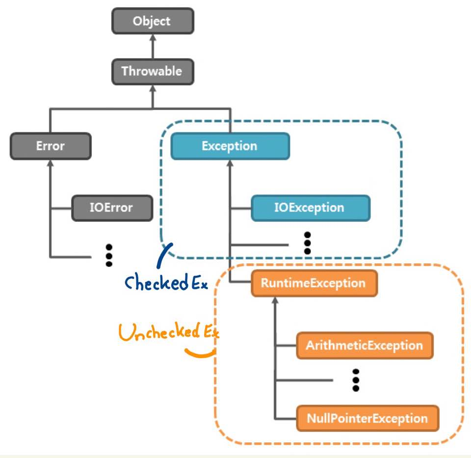
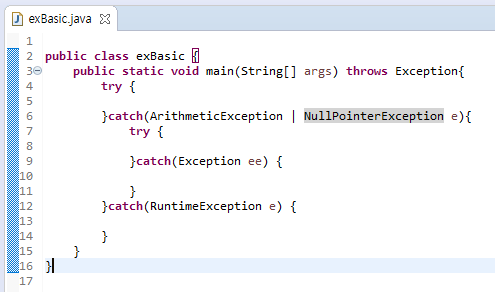
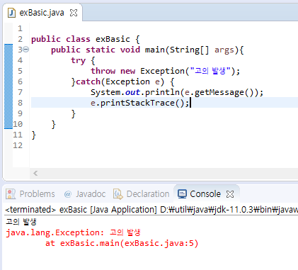
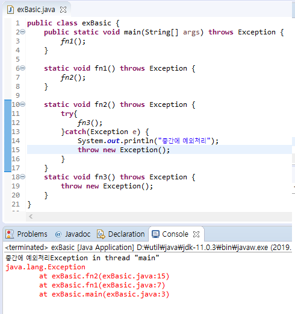
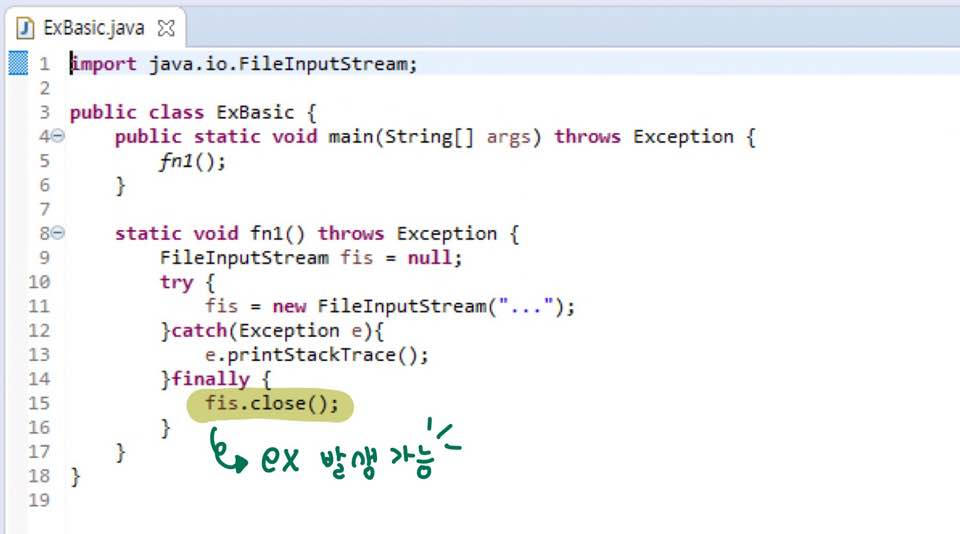
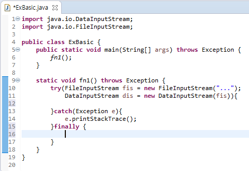
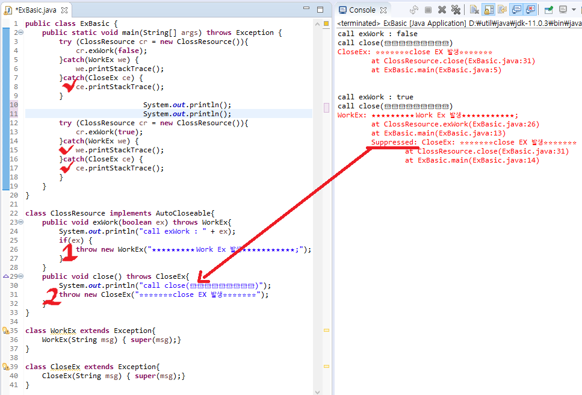

## Exception

**예외처리 exception handling**

```
프로그램 오류의 종류

      > 컴파일 에러
            컴파일시에 발생, 대부분 오타에서 발생 

      > 런타임 에러
            실행시 발생. **프로그래머의 실수**

      > 논리적 에러
            실행은 되지만 의도와 다르게 동작 
```
```
에러와 예외의 정의

      > 에러 error
            프로그램 실행 불가, 수습 불가
            메모리 부족(OutOfMemoryError), 스택오버플로우(StackOverflowError)

      > 예외 exception
            프로그램 실행 가능, 수습 가능
```
> 프로그램의 비정상 종료를 막자! 


## 예외 계층 구조 



||checked Ex|unchecked Ex|
|-----|-----|------|
|클래스|Exception 클래스의 자손들 중 Runtime Exception을 제외한 모든  클래스 |Runtime Exception 클래스와 자손 클래스|
|확인 시점|컴파일 단계|실행단계|
|처리여부|반드시 예외 처리|명시적 처리. 강제 안함|
|예외 발생 시 트랜잭션 roll back |X|O |

## 구문 try-catch-finally
try { <br>
      // 예외 발생 가능성 있는 구문<br>
} catch (ExceptionA | ExceptionB e) {<br>
<br>
      //예외 처리 구문<br>
<br>
} finally {<br>
      // 예외 발생여부 관계 없이 항상 수행될 구문 <br>
}<br>

```
처리 흐름 

      > try블럭 내에서 예외가 발생
            1. 발생한 예외와 일치하는 catch 문 확인
            2-1. 일치 블럭이 있을 경우 : 그 catch블럭 수행 후 전체 try 문을 빠져 나가 다음 과정 처리 
            2-2. 일치 블럭 없을 경우 : 예외는 처리되지 못한다.

      > try블럭 내에서 예외 발생하지 않는 경우 
            try 블럭 수행 후 catch 블럭 처리하지 않고 빠져나가 다음 과정 처리 

try블럭 내에서 예외 발생 유무 관계 없이 finally 블럭은 마지막에 수행 후 try블럭을 빠져 나간다. 
```
```
printStackTrace() :
      예외발생 당시의 호출스택(call stack)에 있었던 메서드의 정보와 예외 메시지를 화면에 출력

getMessage() :
      발생한 예외클래스의 인스턴스에 저장된 메시지를 얻을 수 있다. 
```

## 멀티 catch 블럭

- JDK 1.7부터 '|' 기호를 구분자로 하여 사용 가능 
- 연결된 예외 클래스가 조상과 자손의 관계에 있다면 컴파일 에러 발생(조상만 사용하여 불필요한 코드 제거 의미) 
- 공통 분모인 조상예외 클래스에 선언된 멤버만 사용 가능
 
> 멀티 catch 블록에서 매개변수로 전달받은 예외 객체는 묵시적으로 final 제어자! <br>
> ∴ catch 블록 내에서 해당 매개변수에는 어떠한 값도 대입할 수 없다.



## throw 
```
1. new 연사자를 이용하여 발생시키려는 예외클래스의 객체 생성
      Exception e = new Exception("고의발생");
2. 키워드 throw 를 이용해서 예외 발생 
      throw e;
```



- 메서드 예외<br>
메서드의 throws에 명시하는 것은 예외를 처리하는것이 아니고 자신을 호출한 메서드에게 예외를 전달하여 처리를 떠맡기는 것이다. <br>
<br>
★ fn2() - catch 구문의 throw 는 예외 되던지기(exception re-throwing)

## finally 
- 예외의 발생여부에 상관없이 실행
- try-catch문의 끝에 선택적으로 덧붙여 사용
- ☆ finally 에서도 throw 가능 

## 자동 자원 반환 try-with-resources
- JDK 1.7 부터 추가된 try-catch 문의 변형

기존 finally 구문을 활용한 자원 해제 <br>
<br>

try-with-resources 사용<br>
- 중첩 가능(구분자 ; )<br>
- try 블럭 괄호 안에 변수를 선언하는 것도 가능하며, 선언된 변수는 try 블럭 내에서만 사용 가능. 
<br>

>
> ```
> 자동으로 객체의 close()가 호출될 수 있으려면, 클래스가 AutoCloseable > I/F 구현체여야 한다. 
> 
> public interface AutoCloseable {
>     void close() throws Exception;
> }
> 
> ```

```
try-catch 문을 사용했다면 먼저 발생한 WorkEx는 무시되고 CloseEx 만 출력됐겠지만
Suppressed 머릿말과 함께 억제된 예외 정보도 출력
```
<br>
★ Exception 클래스를 상속받아서 WorkEx, CloseEx와 같은 사용자정의 예외 생성 가능 

## 연결된 예외 chained exception

> ``` 
> try {
>  // raise error
> }catch(Ex1 e1){
>       Ex2 e2 = new Ex2("ex2");
>       e2.initCause(e1);
>       throw e2;
> }
>
> * Throwable initCause(Throwable cause) 지정한 예외를 원인 예외로 등록
> * Throwable getCause() 원인 예외 반환 
> ```