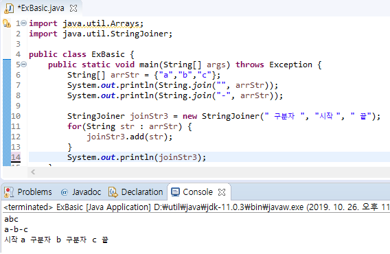

## java.lang 패키지

> 자바프로그래밍에 가장 기본이 되는 클래스을 포함한 패키지로 
> import문 없이 사용 가능 

### Object클래스 
```
- 모든 클래스의 최고 조상이기 때문에 Object클래스의 멤버들은 모든 클래스에서 바로 사용 가능
- 멤버변수는 없고 오직 11개의 메서드만 가지고 있다.
```
#### equals(Object obj)<br>
- 매개변수는 Object > 모든 객체가 매개변수로 대입가능<br>
(Object가 최상위 타입이므로 모든 객체는 Object 타입으로 자동 타입 변환 가능)

- 주소값을 비교하기 때문에 value가 같으면 false 리턴<br>
String, Date, File 클래스 등의 메서드에서 값 비교가 되는 이유는 각 클래스에서 equals 를 오버라이딩했기 때문.

- == 연산자는 주소값을 비교

#### hashCode()<br>
- 데이터관리기법 중의 하나로 다량의 데이터를 저장/검색하는데 유용<br>
- 입력 : 검색값 , 리턴 : 입력값이 저장된 위치의 해시코드 <br>
객체의 주소값으로 해시코드를 반환하기 때문에 같은 해시코드는 없지만,<br>
String클래스는 값으로 해시코드를 반환하도록 오버라이딩되어 있어 값이 같으면 동일한 해시코드를 반환한다.

#### toString()<br>
- 인스턴스에 대한 정보를 문자열로 제공할 목적을 정의한 것<br>
- 오버라이딩하지 않으면 클래스이름@16진수 해시코드 리턴<br>
String, Date클래스 등 별도 오버라이딩되어 있음

#### clone()
- 자신을 복제하여 새로운 인스턴스를 생성<br>
- 단순 값만 복제(얕은 복사, 깊은 복사가 필요할 경우 오버라이딩 할 때 별도 코딩 필요) <br>
super.clone(); <br>
newRetVal = new ReturnValue(retVal);<br>
return newRetVal;<br>
- 오버라이딩 할 경우 <br>
1. Cloneable I/F 구현
2. 접근제어자 protected > public
3. try-catch 내에서 조상클래스 clone() 호출 

### getClass()
- 자신이 속한 클래스의 Class객체를 반환, 이름이 "Class" 인 객체
- 클래스 당 1개만 존재 
- 클래스 파일이 '클래스 로더(Class Loader)에 의해 메모리에 올라갈 때 자동으로 생성<br>
클래스로더 : 실행 시에 필요한 클래스를 동적으로 메모리에 로드<br>
- 클래스 파일을 읽어서 사용하기 편한 형태로 저장<br>
클래스 객체가 메모리에 존재하는지 클래스 패스(path) 따라서 확인<br>
있으면 : 객체의 참조를 반환, 클래스 파일을 읽어서 Class객체로 변환<br>
없으면 : ClassNotFound Ex 발생

### String클래스 
(은지님 심화과정으로 예습한 부분~)
- 생성방법 
1. new 연산자 ; 메모리 할당, 매번 새 인스턴스 생성
2. 리터럴 방법 ; 기 존재 인스턴스 재사용, == 연산자 true 반환

> ```
> String a = "test";
> String b = "test";
> 
> System.out.println(a == b); // true
> 
> b = "test test";
> 
> System.out.println(a); // test 
> System.out.println(b); // test test
> 
> System.out.println(a == b); // false
> ```

- 변경 불가 클래스, 읽기 O, 변경 X 
- '+' 문자열 결합은 새로운 String 인스턴스가 생성되는 것(메모리에 올라감) <br>
때문에 문자열 결합할 때 StringBuffer 이용이 좋다
- join(), StringJoiner<br>
JDK1.8 추가<br>
split() 반대 작업 <br>
<br>

- [StringBuffer, StringJoiner 예제 ↗](https://futurecreator.github.io/2018/06/02/java-string-joiner/)
- [StringBuffer, StringJoiner 성능 비교 ↗](https://data-traveler.tistory.com/22)

#### 문자 인코딩 변환 
```
byte[] utf8_str = "가".getBytes("UTF-8");  // 문자열 > utf-8
String str = new String(utf8_str, "UTF-8") // byte 배열 > 문자열 

```

#### String.format()
String str = String.format("%d 더하기 %d는 %d", 3, 5, 3+5)

#### String 형변환 
- 기본형 > String <br>
String str = 10 + ""; // 편리<br>
String str = String.valueOf(10); // 성능 ↗<br>
- String > 기본형 <br>
int i = Integer.parseInt("-100");//JDK1.7부터 부호 허용<br>
int i = Integer.valueOf("100");//반환 타입은 integer, 내부에서 parseInt 를 호출하고 있기 때문에 성능은 동일 <br>